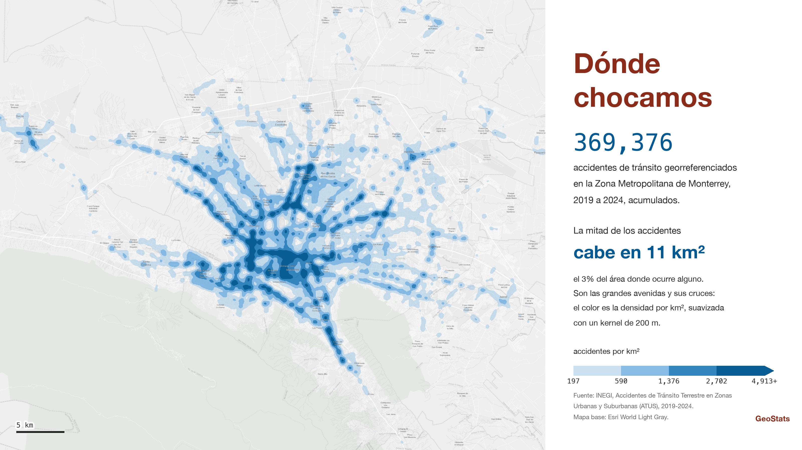
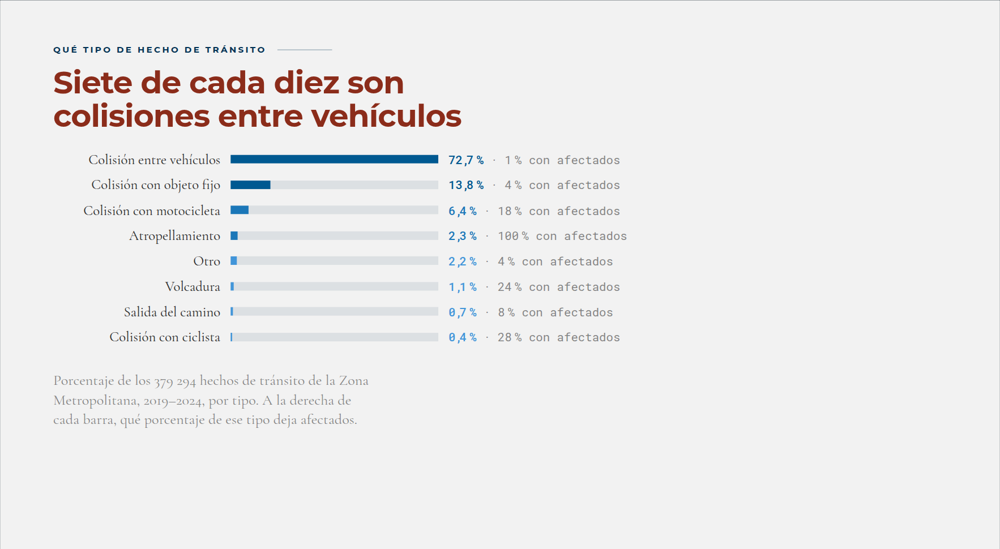
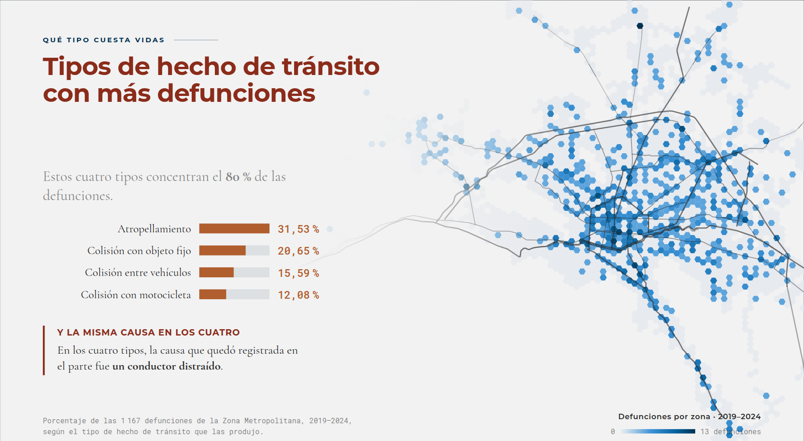
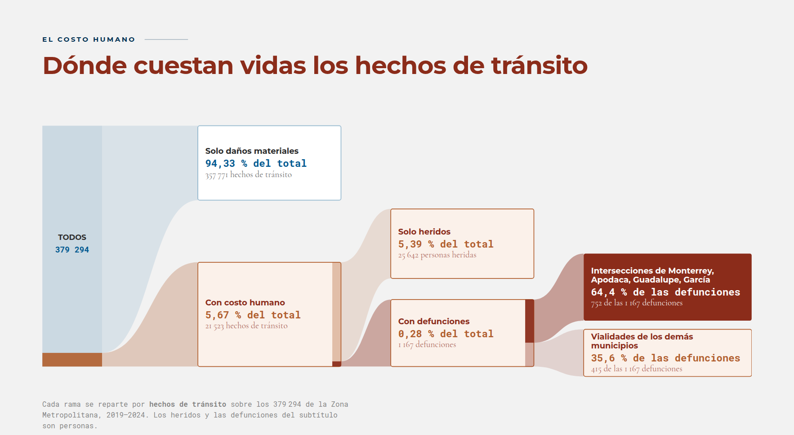
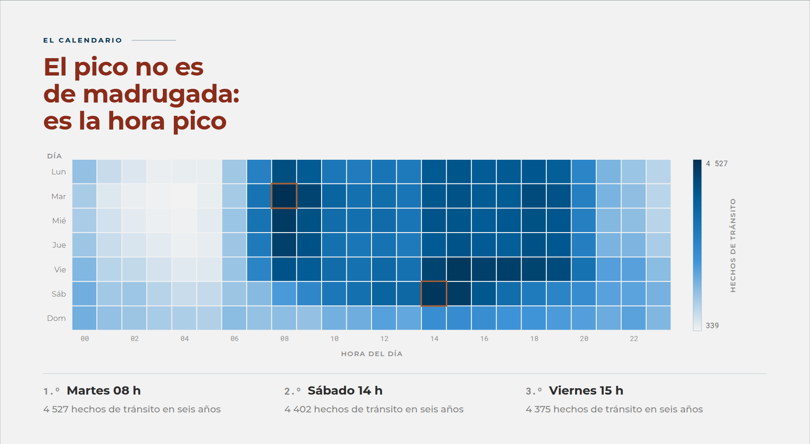
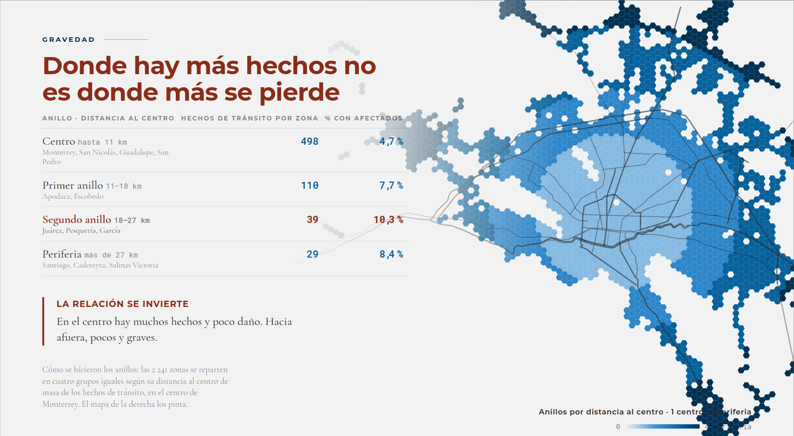
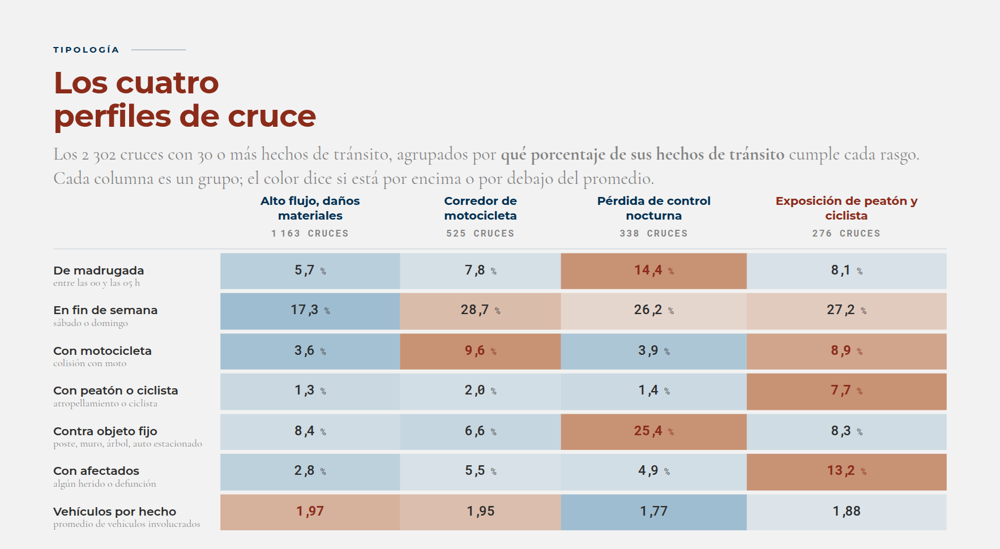
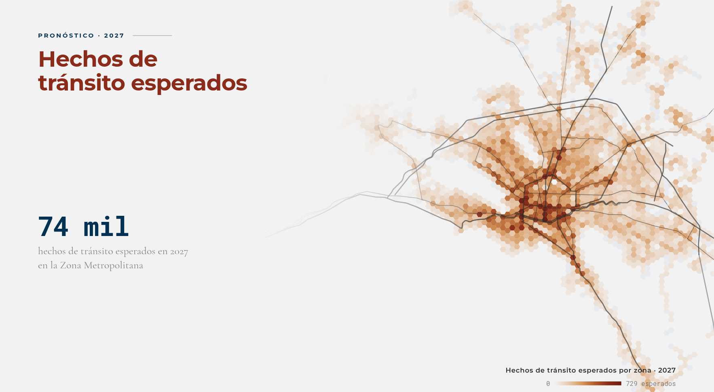
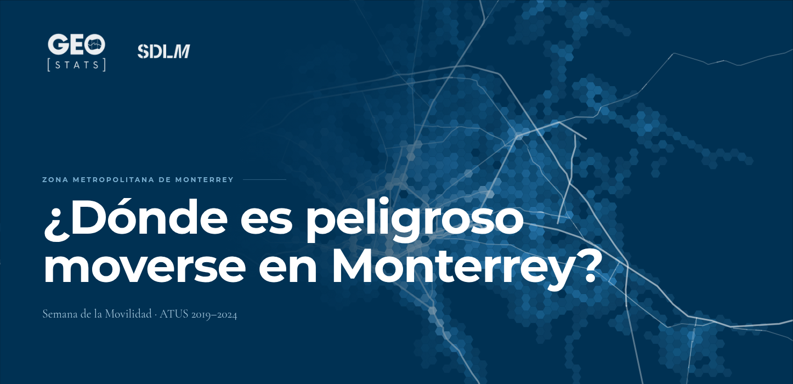
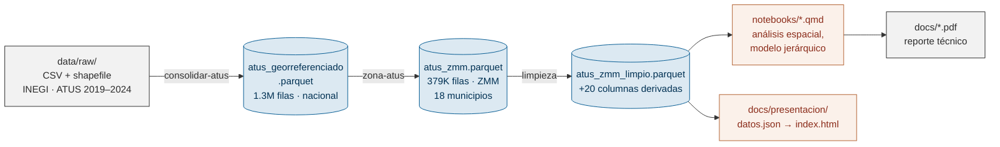

# GeoStats

### ¿Dónde es peligroso moverse en Monterrey?

Análisis geoestadístico de los **379,294 hechos de tránsito** registrados por
el INEGI (ATUS) en la Zona Metropolitana de Monterrey entre 2019 y 2024 — y un
modelo que dice dónde va a pasar en 2027.

[**→ Ver la presentación interactiva**](docs/presentacion/) · [PDF de la presentación](docs/presentacion.pdf) · [Documentación técnica](docs/desarrollo.md)

<p align="center">
  
</p>

<p align="center">
  
  
  
  
</p>

## Qué es

Un pipeline de datos + notebooks (no una aplicación) que toma el censo de
accidentes de tránsito del INEGI, lo recorta a los 18 municipios de la Zona
Metropolitana de Monterrey, lo divide en una rejilla de **2,241 hexágonos de
un kilómetro** y responde tres preguntas: **dónde** se concentra el riesgo,
**a quién** le cuesta más caro, y **qué tan bien se puede anticipar**.

Proyecto de la Semana de la Movilidad, por Angel Eduardo Luna, Jenaro Alcaraz,
Roberto Pérez, Damián Yul Reynoso y Mateo Rodolfo Flores.

## Lo que encontramos

<table>
<tr>
<td width="45%">

**Siete de cada diez son colisiones entre vehículos**

Pero el tipo más común es el que menos daño hace por hecho. Un
atropellamiento deja afectados el 100 % de las veces; una colisión entre
vehículos, el 1 %.

</td>
<td width="55%"></td>
</tr>
<tr>
<td width="45%">

**Cuatro tipos concentran el 80 % de las defunciones**

Atropellamiento, colisión con objeto fijo, colisión entre vehículos y
colisión con motocicleta. En los cuatro, la causa que quedó registrada en
el parte fue la misma: un conductor distraído.

</td>
<td width="55%"></td>
</tr>
<tr>
<td width="45%">

**El costo humano es la excepción, no la regla — pero cuando cuesta, cuesta caro**

El 92.9 % de los hechos de tránsito son solo daños materiales. Del 0.28 %
que dejó alguna defunción, el 64.4 % de las 1,167 muertes se concentra en
intersecciones de solo cuatro municipios: Monterrey, Apodaca, Guadalupe y
García.

</td>
<td width="55%"></td>
</tr>
<tr>
<td width="45%">

**El pico no es de madrugada: es la hora pico**

Martes 8 h, sábado 14 h y viernes 15 h son las horas más cargadas de la
semana — casi empatadas. Solo el 8.6 % de los hechos ocurre entre
medianoche y las cinco de la mañana: es exposición, no imprudencia
nocturna.

</td>
<td width="55%"></td>
</tr>
<tr>
<td width="45%">

**Donde hay más hechos no es donde más se pierde**

En el centro de la ciudad hay 498 hechos de tránsito por zona y el 4.7 %
deja afectados. En la periferia hay 29 por zona, pero el 8.4 % deja
afectados. Un ranking hecho solo con el conteo pone a la periferia hasta
abajo, y ahí es donde la gente sale peor parada.

</td>
<td width="55%"></td>
</tr>
<tr>
<td width="45%">

**Los cruces se agrupan en cuatro perfiles**

De los 2,302 cruces con 30 o más hechos, uno agrupa por moto, otro por
pérdida de control nocturna contra objetos fijos, otro por peatones y
ciclistas. El grupo más grande es el menos dañino por hecho; el más chico
es el que manda gente al hospital.

</td>
<td width="55%"></td>
</tr>
<tr>
<td width="45%">

**El mapa casi no se mueve — y eso se puede anticipar**

De los 200 peores cruces, 155 aparecen en los seis años. Un modelo
jerárquico bayesiano entrenado con 2019–2023 y probado a ciegas contra
2024 falló el total metropolitano por solo 0.6 %. Para 2027 espera
**74 mil** hechos de tránsito en la Zona Metropolitana.

</td>
<td width="55%"></td>
</tr>
</table>

## La presentación

<p align="center">
  
</p>

31 láminas en un solo archivo HTML de media megabyte, sin imágenes: los
mapas, el calendario y las gráficas se dibujan en el navegador. Se abre con
doble clic, funciona sin conexión y guarda la lámina en la URL.

```
docs/presentacion/index.html
```

| Tecla | Qué hace |
|---|---|
| `←` `→` `espacio` | avanzar y retroceder |
| `O` | índice navegable |
| `N` | notas del presentador |
| `F` | pantalla completa |

Detalle de cómo está armada, qué representa cada mapa y cómo regenerarla en
[`docs/presentacion/README.md`](docs/presentacion/README.md).

## Cómo está hecho



Python + `uv`, con una regla fija: **nunca se escribe en `data/raw/`**.
`processed/` es borrable y regenerable con tres comandos:

```bash
uv sync
uv run consolidar-atus   # raw/ → atus_georreferenciado.parquet (nacional)
uv run zona-atus         # → atus_zmm.parquet (Zona Metropolitana de Monterrey)
uv run limpiar-atus      # → atus_zmm_limpio.parquet (+20 columnas derivadas)
```

El resto — estructura de carpetas, cómo se limpia el encoding, por qué `ID`
no es llave única, la identidad visual de las gráficas y todo lo que no es
obvio de estos datos — está en
[**`docs/desarrollo.md`**](docs/desarrollo.md).

## Fuente de los datos

INEGI, *Accidentes de Tránsito Terrestre en Zonas Urbanas y Suburbanas*
(ATUS), 2019–2024. Censo, no encuesta: no estima, cuenta, a partir de los
partes que levantan las policías de tránsito de cada municipio.
[inegi.org.mx/programas/accidentes](https://www.inegi.org.mx/programas/accidentes/)
